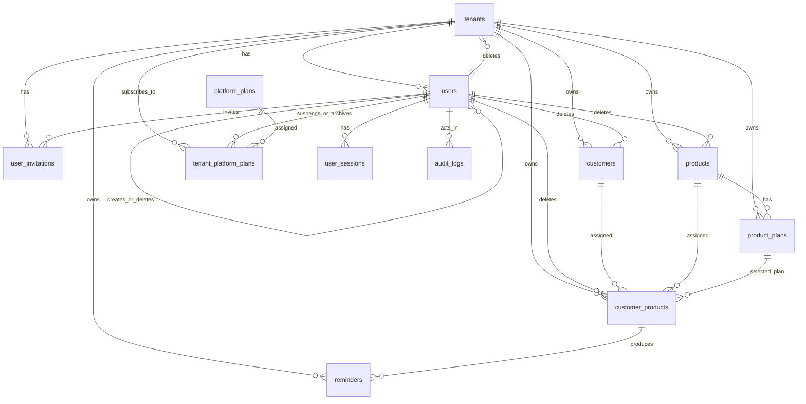

# Database Schema and Table Relationships

Source of truth: `backend/core-monolith/src/main/resources/db/migration/V1__init.sql` through `V12__add_custom_price_tenant_platform_plan.sql`, cross-checked against JPA entities under `backend/core-monolith/src/main/java/np/com/abhishekojha/coremonolith/modules`.

## Project Functionality

PayNest is a multi-tenant SaaS payment and subscription management system. It lets platform administrators manage tenant companies, tenant users manage customers and products, and the system track customer product subscriptions, expiry dates, reminder delivery, and audit history.

Core functions:

- Platform administration: create, suspend, archive, and monitor tenants.
- Tenant access control: users belong to tenants unless they are platform-level `SUPER_ADMIN` users.
- Invitation-based onboarding: invite tenant admins/users and accept invitations with token-based activation.
- Product catalog: define tenant-owned products and product plans with prices and billing cadences.
- Customer subscriptions: assign products/plans to customers, track status and dates, and optionally override prices.
- Reminder workflow: record renewal reminder sends/failures/skips for customer product expirations.
- Audit trail: store actor, action, resource, and JSON old/new values for important changes.
- Platform plans: define platform subscription plans and assign them to tenants with lifecycle dates and optional custom pricing.

## Entity Relationship Overview

## Enum Types

PostgreSQL enum-backed fields:

| Enum | Values | Used by |
|---|---|---|
| `audit_action` | `CREATE`, `UPDATE`, `DELETE`, `STATUS_CHANGE`, `LOGIN`, `LOGOUT`, `LOGIN_FAILED` | `audit_logs.action` |
| `tenant_status` | `ACTIVE`, `SUSPENDED`, `ARCHIVED` | `tenants.status` |
| `user_role` | `SUPER_ADMIN`, `TENANT_ADMIN`, `TENANT_USER` | `users.role` |
| `user_status` | `PENDING`, `ACTIVE`, `DISABLED`, `DELETED` | `users.status` |
| `invitation_role` | `TENANT_ADMIN`, `TENANT_USER` | `user_invitations.role` |
| `invitation_status` | `PENDING`, `ACCEPTED`, `EXPIRED`, `REVOKED` | `user_invitations.status` |
| `billing_cadence` | `WEEKLY`, `MONTHLY`, `QUARTERLY`, `ANNUALLY` | `products.billing_cadence`, `product_plans.billing_cadence` |
| `product_status` | `ACTIVE`, `INACTIVE`, `DELETED` | `products.status` |
| `customer_status` | `ACTIVE`, `DELETED` | `customers.status` |
| `customer_product_status` | `ACTIVE`, `PAUSED`, `CANCELLED` | `customer_products.status` |
| `reminder_status` | `SENT`, `FAILED`, `SKIPPED` | `reminders.status` |

Application enum stored as `VARCHAR`, not a PostgreSQL enum:

| Enum | Values | Used by |
|---|---|---|
| `PlatformPlanStatus` | `ACTIVE`, `SUSPENDED`, `ARCHIVED` | `tenant_platform_plans.status` |

## Common Audit Columns

Most domain entities extend `BaseAuditEntity` and include:

| Column | Type | Notes |
|---|---|---|
| `created_at` | timestamp | Set when the row is created. |
| `updated_at` | timestamp | Set when the row is updated. |

Several tables also implement soft delete or lifecycle fields such as `deleted_at`, `deleted_by`, `archived_at`, `suspended_at`, and status columns.

## Tables

### `tenants`

Represents a customer organization/account in the multi-tenant platform.

| Column | Type | Constraints/Notes |
|---|---|---|
| `id` | `BIGINT` | Primary key, identity |
| `created_at` | `TIMESTAMP` | Not null |
| `updated_at` | `TIMESTAMP` | Not null |
| `name` | `VARCHAR(100)` | Not null |
| `slug` | `VARCHAR(50)` | Not null, unique |
| `company_email` | `VARCHAR(255)` | Not null |
| `timezone` | `VARCHAR(100)` | Not null |
| `status` | `tenant_status` | Not null |
| `archived_at` | `TIMESTAMP` | Nullable |
| `deleted_at` | `TIMESTAMP` | Nullable |
| `deleted_by` | `BIGINT` | FK to `users.id`, nullable |

Relationships:

- One tenant has many `users`, `customers`, `products`, `product_plans`, `customer_products`, `reminders`, `user_invitations`, and `tenant_platform_plans`.
- `deleted_by` links to the user who deleted the tenant.

### `users`

Stores login identities and role/status information.

| Column | Type | Constraints/Notes |
|---|---|---|
| `id` | `BIGINT` | Primary key, identity |
| `created_at` | `TIMESTAMP` | Not null |
| `updated_at` | `TIMESTAMP` | Not null |
| `tenant_id` | `BIGINT` | FK to `tenants.id`, nullable for `SUPER_ADMIN` |
| `email` | `VARCHAR(255)` | Not null, globally unique |
| `full_name` | `VARCHAR(100)` | Nullable |
| `password_hash` | `VARCHAR(255)` | Not null |
| `role` | `user_role` | Not null |
| `status` | `user_status` | Not null |
| `email_verified_at` | `TIMESTAMP` | Nullable |
| `last_login_at` | `TIMESTAMP` | Nullable |
| `created_by` | `BIGINT` | FK to `users.id`, nullable |
| `deleted_by` | `BIGINT` | FK to `users.id`, nullable |
| `deleted_at` | `TIMESTAMP` | Nullable |

Relationships:

- Many users belong to one tenant.
- Users can create/delete other users through self-referencing `created_by` and `deleted_by`.
- Users own sessions, invitations sent, audit log entries, and lifecycle actions on tenant platform plans.

### `user_sessions`

Stores refresh-token sessions for authentication.

| Column | Type | Constraints/Notes |
|---|---|---|
| `id` | `BIGINT` | Primary key, identity |
| `user_id` | `BIGINT` | FK to `users.id`, not null |
| `refresh_token_hash` | `VARCHAR(255)` | Not null, unique |
| `issued_at` | `TIMESTAMP` | Not null |
| `expires_at` | `TIMESTAMP` | Not null |
| `revoked_at` | `TIMESTAMP` | Nullable |
| `replaced_by_session_id` | `BIGINT` | FK to `user_sessions.id`, nullable |
| `ip_address` | `VARCHAR(45)` | Nullable |
| `user_agent` | `TEXT` | Nullable |

Relationships:

- Many sessions belong to one user.
- A session may point to the replacement session created during token rotation.

### `user_invitations`

Tracks tenant user/admin invitations.

| Column | Type | Constraints/Notes |
|---|---|---|
| `id` | `BIGINT` | Primary key, identity |
| `tenant_id` | `BIGINT` | FK to `tenants.id`, not null |
| `email` | `VARCHAR(255)` | Not null |
| `role` | `invitation_role` | Not null |
| `invited_by_user_id` | `BIGINT` | FK to `users.id`, not null |
| `token_hash` | `VARCHAR(255)` | Not null, unique |
| `status` | `invitation_status` | Not null, default `PENDING` |
| `expires_at` | `TIMESTAMP` | Not null |
| `accepted_at` | `TIMESTAMP` | Nullable |
| `created_at` | `TIMESTAMP` | Not null |

Indexes:

- `idx_invitations_tenant_status (tenant_id, status)`

Relationships:

- Many invitations belong to one tenant.
- Each invitation is created by one user.

### `audit_logs`

Stores auditable events.

| Column | Type | Constraints/Notes |
|---|---|---|
| `id` | `BIGINT` | Primary key, identity |
| `actor_id` | `BIGINT` | FK to `users.id`, not null |
| `action` | `audit_action` | Not null |
| `resource_type` | `VARCHAR(50)` | Not null |
| `resource_id` | `BIGINT` | Nullable |
| `old_value` | `JSONB` | Nullable |
| `new_value` | `JSONB` | Nullable |
| `user_agent` | `TEXT` | Nullable |
| `created_at` | `TIMESTAMP` | Not null |

Relationships:

- Many audit logs belong to one actor user.
- `resource_type` and `resource_id` are polymorphic references; they are not enforced by foreign keys.

### `products`

Tenant-owned product catalog items.

| Column | Type | Constraints/Notes |
|---|---|---|
| `id` | `BIGINT` | Primary key, identity |
| `tenant_id` | `BIGINT` | FK to `tenants.id`, not null |
| `name` | `VARCHAR(200)` | Not null |
| `description` | `TEXT` | Nullable |
| `price` | `NUMERIC(19,4)` | Not null |
| `currency` | `VARCHAR(3)` | Not null, default `USD` |
| `billing_cadence` | `billing_cadence` | Not null |
| `status` | `product_status` | Not null, default `ACTIVE` |
| `created_at` | `TIMESTAMP` | Not null |
| `updated_at` | `TIMESTAMP` | Not null |
| `deleted_at` | `TIMESTAMP` | Nullable |
| `deleted_by` | `BIGINT` | FK to `users.id`, nullable |

Indexes:

- `idx_products_tenant_status (tenant_id, status)`

Relationships:

- Many products belong to one tenant.
- One product has many `product_plans`.
- One product can be assigned many times through `customer_products`.

### `product_plans`

Tenant-owned pricing options under a product.

| Column | Type | Constraints/Notes |
|---|---|---|
| `id` | `BIGSERIAL` | Primary key |
| `tenant_id` | `BIGINT` | FK to `tenants.id`, not null |
| `product_id` | `BIGINT` | FK to `products.id`, not null |
| `name` | `VARCHAR(200)` | Not null |
| `price` | `NUMERIC(19,4)` | Not null |
| `currency` | `VARCHAR(3)` | Not null, default `USD` |
| `billing_cadence` | `billing_cadence` | Not null |
| `created_at` | `TIMESTAMPTZ` | Not null, default `NOW()` |
| `updated_at` | `TIMESTAMPTZ` | Not null, default `NOW()` |

Indexes:

- `idx_product_plans_product (product_id)`
- `idx_product_plans_tenant (tenant_id)`

Relationships:

- Many product plans belong to one tenant.
- Many product plans belong to one product.
- A product plan may be referenced by many `customer_products`.

### `customers`

Tenant-owned customer records.

| Column | Type | Constraints/Notes |
|---|---|---|
| `id` | `BIGINT` | Primary key, identity |
| `tenant_id` | `BIGINT` | FK to `tenants.id`, not null |
| `name` | `VARCHAR(200)` | Not null |
| `email` | `VARCHAR(255)` | Not null |
| `phone` | `VARCHAR(50)` | Nullable |
| `address` | `TEXT` | Nullable |
| `notes` | `TEXT` | Nullable |
| `status` | `customer_status` | Not null, default `ACTIVE` |
| `created_at` | `TIMESTAMP` | Not null |
| `updated_at` | `TIMESTAMP` | Not null |
| `deleted_at` | `TIMESTAMP` | Nullable |
| `deleted_by` | `BIGINT` | FK to `users.id`, nullable |

Constraints and indexes:

- `uc_customers_tenant_email UNIQUE (tenant_id, email)`
- `idx_customers_tenant_status (tenant_id, status)`

Relationships:

- Many customers belong to one tenant.
- One customer can have many `customer_products`.

### `customer_products`

Join/subscription table that assigns a product and optional product plan to a customer.

| Column | Type | Constraints/Notes |
|---|---|---|
| `id` | `BIGSERIAL` | Primary key |
| `tenant_id` | `BIGINT` | FK to `tenants.id`, not null |
| `customer_id` | `BIGINT` | FK to `customers.id`, not null |
| `product_id` | `BIGINT` | FK to `products.id`, not null |
| `product_plan_id` | `BIGINT` | FK to `product_plans.id`, nullable |
| `custom_price` | `NUMERIC(19,4)` | Nullable |
| `status` | `customer_product_status` | Not null, default `ACTIVE` |
| `starts_at` | `TIMESTAMPTZ` | Not null, default `NOW()` |
| `ends_at` | `TIMESTAMPTZ` | Nullable |
| `notes` | `TEXT` | Nullable |
| `deleted_at` | `TIMESTAMPTZ` | Nullable |
| `deleted_by` | `BIGINT` | FK to `users.id`, nullable |
| `created_at` | `TIMESTAMPTZ` | Not null, default `NOW()` |
| `updated_at` | `TIMESTAMPTZ` | Not null, default `NOW()` |

Indexes:

- `idx_cp_tenant_customer (tenant_id, customer_id)`
- `idx_cp_tenant_status (tenant_id, status)`

Relationships:

- Many customer-product assignments belong to one tenant.
- Many assignments belong to one customer.
- Many assignments reference one product.
- Many assignments may reference one product plan.
- One assignment can produce many reminder records.

Migration note:

- `price` and `currency` were added in `V6` and made nullable in `V9`, but were dropped in `V11`. The current `main` schema uses `product_plan_id` and `custom_price` instead.

### `reminders`

Records reminder attempts for customer product expirations.

| Column | Type | Constraints/Notes |
|---|---|---|
| `id` | `BIGSERIAL` | Primary key |
| `tenant_id` | `BIGINT` | FK to `tenants.id`, not null |
| `customer_product_id` | `BIGINT` | FK to `customer_products.id`, not null |
| `status` | `reminder_status` | Not null |
| `sent_at` | `TIMESTAMPTZ` | Nullable |
| `error_message` | `TEXT` | Nullable |
| `days_before_expiry` | `INT` | Nullable |
| `created_at` | `TIMESTAMPTZ` | Not null, default `NOW()` |
| `updated_at` | `TIMESTAMPTZ` | Not null, default `NOW()` |

Indexes:

- `idx_reminders_tenant (tenant_id, created_at DESC)`
- `idx_reminders_cp_days (customer_product_id, days_before_expiry, status)`

Relationships:

- Many reminders belong to one tenant.
- Many reminders belong to one customer-product assignment.

Migration note:

- `retry_count` was added in `V10` and dropped in `V11`; it is not part of the current schema.

### `platform_plans`

Platform-level SaaS plans that can be assigned to tenant accounts.

| Column | Type | Constraints/Notes |
|---|---|---|
| `id` | `BIGINT` | Primary key, identity |
| `created_at` | `TIMESTAMP(6)` | Not null |
| `updated_at` | `TIMESTAMP(6)` | Not null |
| `name` | `VARCHAR(100)` | Not null |
| `price` | `DECIMAL(19,4)` | Not null |

Relationships:

- One platform plan can be assigned to many tenants through `tenant_platform_plans`.

### `tenant_platform_plans`

Assigns a platform plan to a tenant and tracks the tenant's platform subscription lifecycle.

| Column | Type | Constraints/Notes |
|---|---|---|
| `id` | `BIGINT` | Primary key, identity |
| `created_at` | `TIMESTAMP(6)` | Not null |
| `updated_at` | `TIMESTAMP(6)` | Not null |
| `tenant_id` | `BIGINT` | FK to `tenants.id`, not null |
| `plan_id` | `BIGINT` | FK to `platform_plans.id`, not null |
| `custom_price` | `DECIMAL` | Nullable |
| `status` | `VARCHAR(20)` | Not null; Java enum `PlatformPlanStatus` |
| `start_date` | `TIMESTAMP(6)` | Not null |
| `end_date` | `TIMESTAMP(6)` | Not null |
| `suspended_by` | `BIGINT` | FK to `users.id`, nullable |
| `suspended_at` | `TIMESTAMP(6)` | Nullable |
| `archived_by` | `BIGINT` | FK to `users.id`, nullable |
| `archived_at` | `TIMESTAMP(6)` | Nullable |

Relationships:

- Many tenant platform plan rows belong to one tenant.
- Many tenant platform plan rows reference one platform plan.
- `suspended_by` and `archived_by` reference users who performed lifecycle actions.

## Relationship Summary

| Parent | Child | Cardinality | FK |
|---|---|---|---|
| `tenants` | `users` | 1 to many | `users.tenant_id` |
| `tenants` | `user_invitations` | 1 to many | `user_invitations.tenant_id` |
| `tenants` | `products` | 1 to many | `products.tenant_id` |
| `tenants` | `product_plans` | 1 to many | `product_plans.tenant_id` |
| `tenants` | `customers` | 1 to many | `customers.tenant_id` |
| `tenants` | `customer_products` | 1 to many | `customer_products.tenant_id` |
| `tenants` | `reminders` | 1 to many | `reminders.tenant_id` |
| `tenants` | `tenant_platform_plans` | 1 to many | `tenant_platform_plans.tenant_id` |
| `users` | `user_sessions` | 1 to many | `user_sessions.user_id` |
| `users` | `audit_logs` | 1 to many | `audit_logs.actor_id` |
| `users` | `user_invitations` | 1 to many | `user_invitations.invited_by_user_id` |
| `users` | `users` | self reference | `users.created_by`, `users.deleted_by` |
| `users` | `user_sessions` | self reference | `user_sessions.replaced_by_session_id` |
| `products` | `product_plans` | 1 to many | `product_plans.product_id` |
| `customers` | `customer_products` | 1 to many | `customer_products.customer_id` |
| `products` | `customer_products` | 1 to many | `customer_products.product_id` |
| `product_plans` | `customer_products` | 1 to many | `customer_products.product_plan_id` |
| `customer_products` | `reminders` | 1 to many | `reminders.customer_product_id` |
| `platform_plans` | `tenant_platform_plans` | 1 to many | `tenant_platform_plans.plan_id` |

## Tenant Isolation Model

Most business tables carry `tenant_id` directly, even where the tenant could be inferred through another relationship. This supports tenant-scoped querying and access control:

- Tenant-scoped users can only access records for their tenant.
- `SUPER_ADMIN` can access platform-wide records and tenant administration.
- Product, customer, customer-product, reminder, invitation, and product-plan records should be filtered by `tenant_id`.

## Notes and Caveats

- `audit_logs` does not include a `tenant_id` column in the current schema. Tenant-specific audit views must derive tenant context from the actor or resource metadata.
- `tenant_platform_plans.status` is a `VARCHAR(20)` column, while most other statuses are PostgreSQL enums.
- `customer_products.product_plan_id` is nullable, so a customer product can reference only the base product and use `custom_price` or product defaults depending on service logic.
- The schema has no explicit cascading deletes. Soft-delete/status fields are used for lifecycle management instead.
